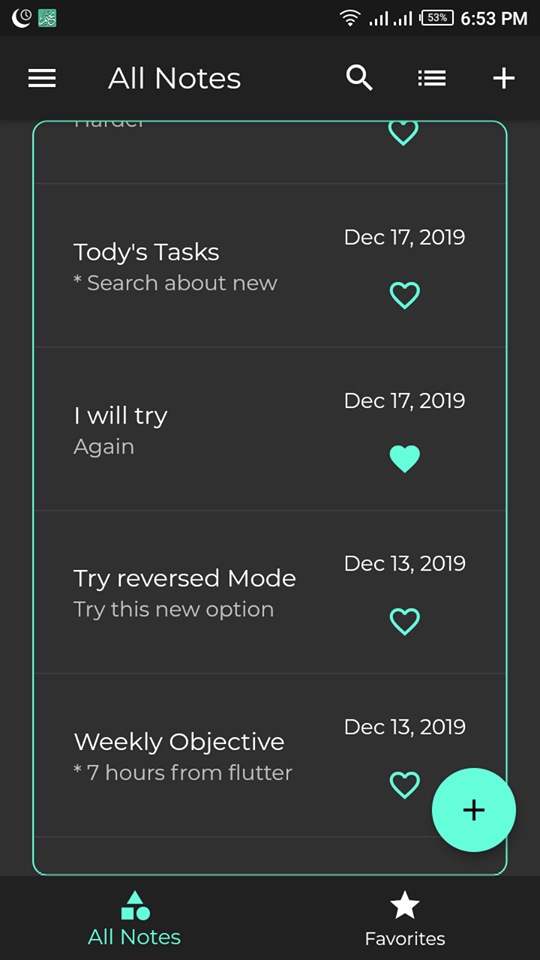
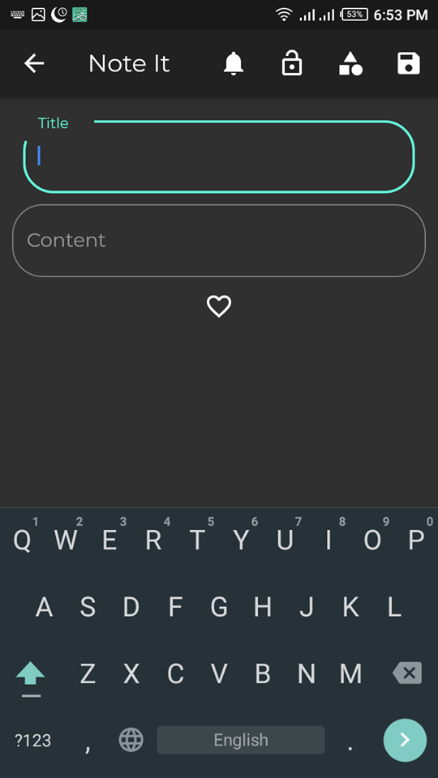
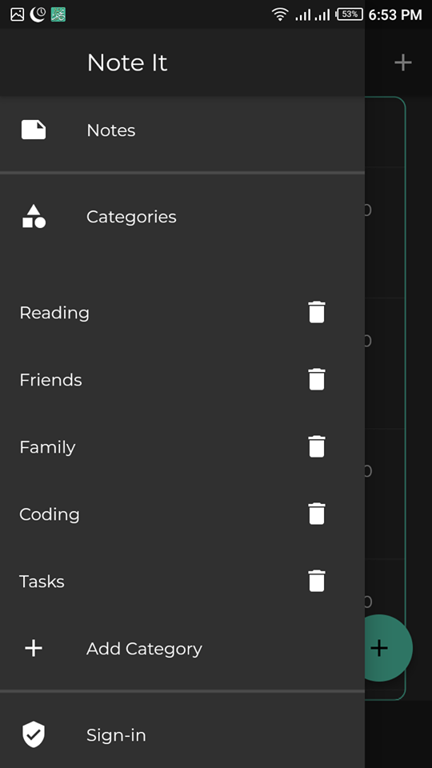
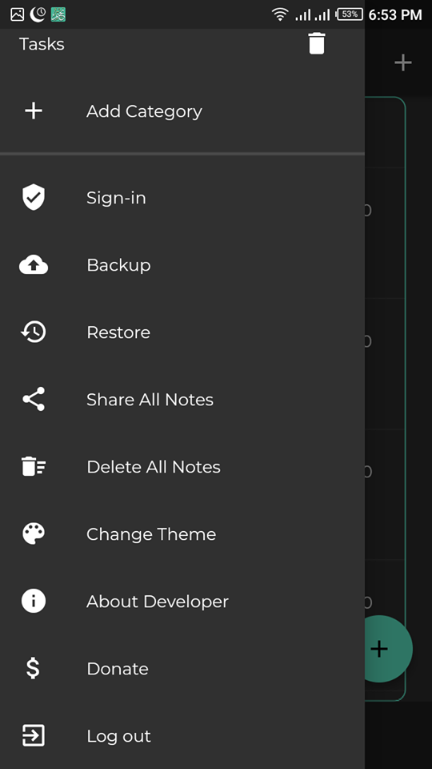
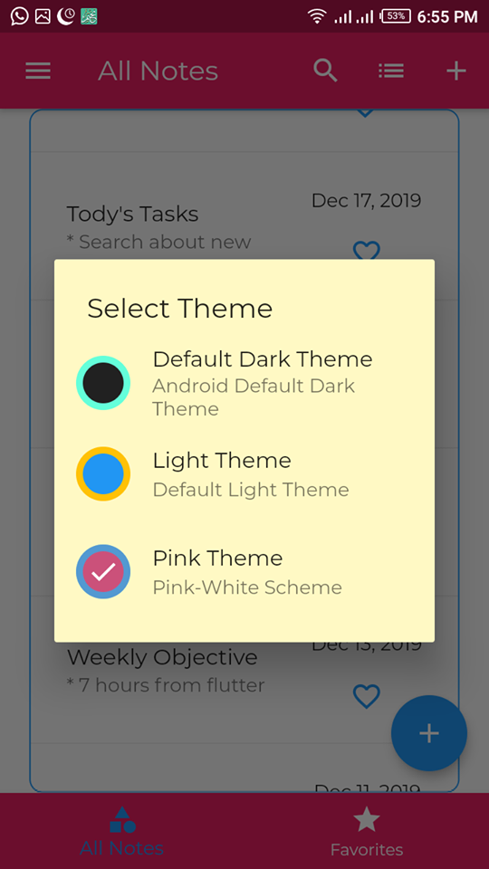
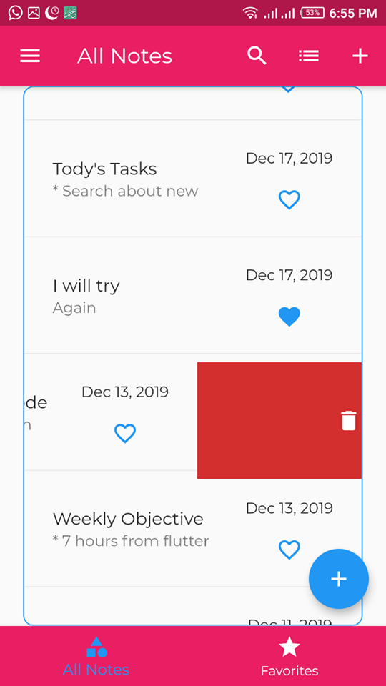

# Note It

Note App in Flutter.

Note App with a lot of features like authentication and database using Rest Api and firebase.
ability to share notes and add categories and other features.

## Screenshots

Created By 

[Ahmad El-Baz](https://github.com/ahmadelbaz) [Ahmad El-Baz](https://www.facebook.com/ahmed.elbaz11) [YouTube](youtube.com/c/ahmeedelbaz)
